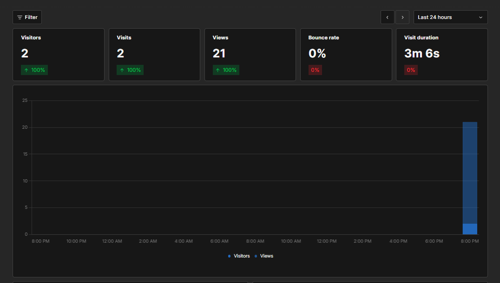

I have finally set up traffic tracking on this website using Umami, a privacy-focused web analytics tool. With this, I can gain insights into how visitors interact with my site while respecting their privacy. I'm excited to see how this will help me improve the user experience and understand my audience better. Of course, I have also disabled tracking from my own IP address to ensure that my visits don't skew the data. 😺

