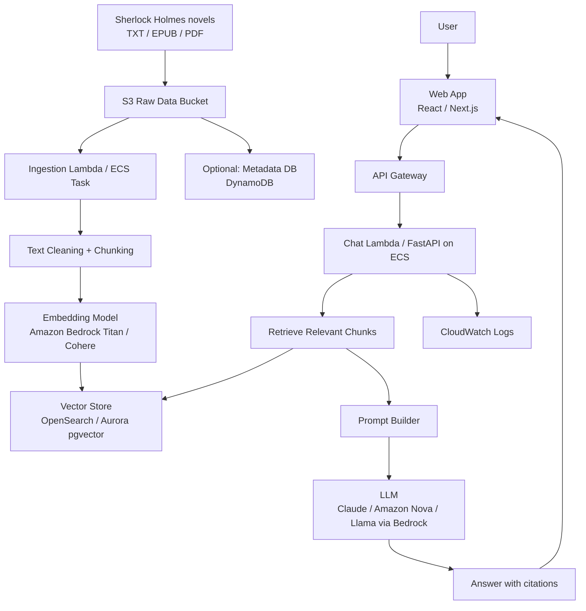

# 1. Architecture Diagram

# 2. Problem Statement

Build an AI chatbot that allows users to "talk to" the Sherlock Holmes canon.

Instead of manually searching long novels, users can ask natural-language questions such as:

> “What does Holmes think about observation?”

> “Summarise Irene Adler’s role.”

> “Which cases involve poison?”

> “Answer in Holmes’ tone, but cite the story.”

The system solves:

**Knowledge access:** Converts long literary text into searchable semantic knowledge.

**Conversational UX:** Lets users explore literature through dialogue.

**Grounded generation:** Uses RAG so answers are based on retrieved book passages, reducing hallucination.

**Portfolio value:** Demonstrates LLM integration, vector search, AWS architecture, cost trade-offs, and AI product thinking.

# 3. Architecture Decisions

To Research

# 4. Trade-offs

## Cost vs Performance

To Research

## Latency vs Complexity

To Research

# Latest MVP Scope

1. Ingest public-domain Sherlock Holmes text into S3.
2. Clean and chunk text by story/chapter.
3. Generate embeddings using Bedrock.
4. Store vectors in PostgreSQL pgvector.
5. Build a Lambda API:
6. Build a simple web chatbot.
7. Add evaluation questions to test answer quality.
