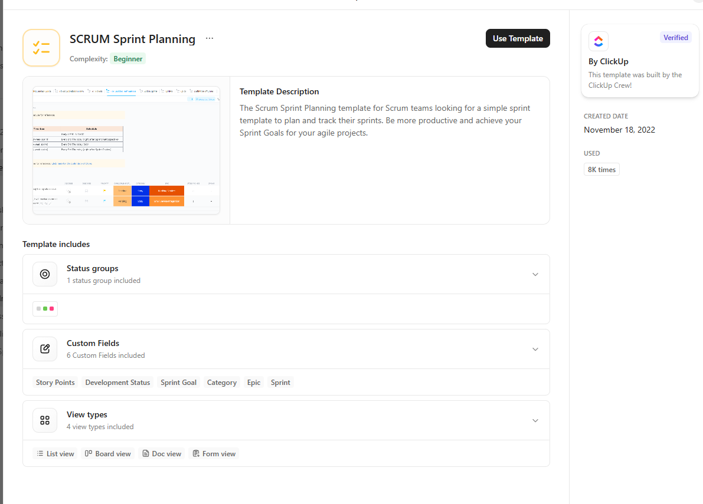
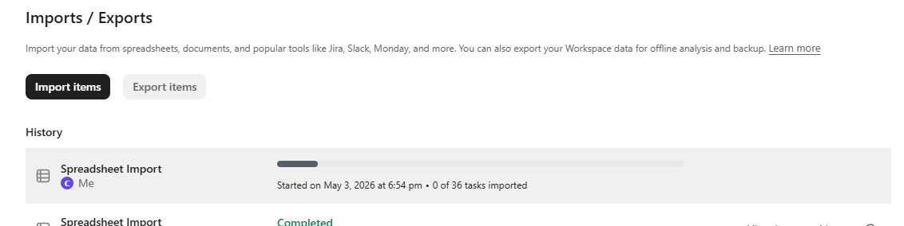
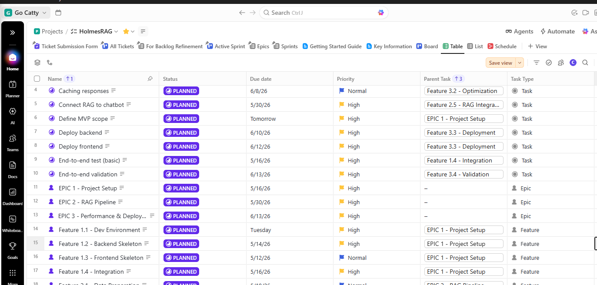
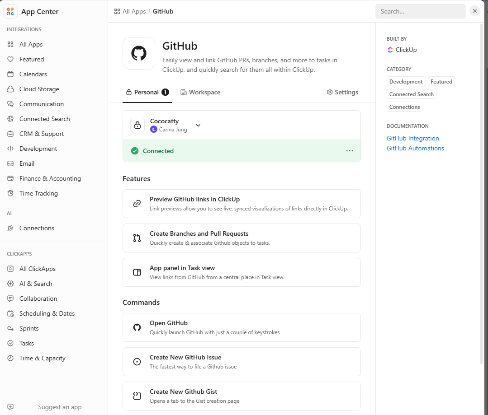
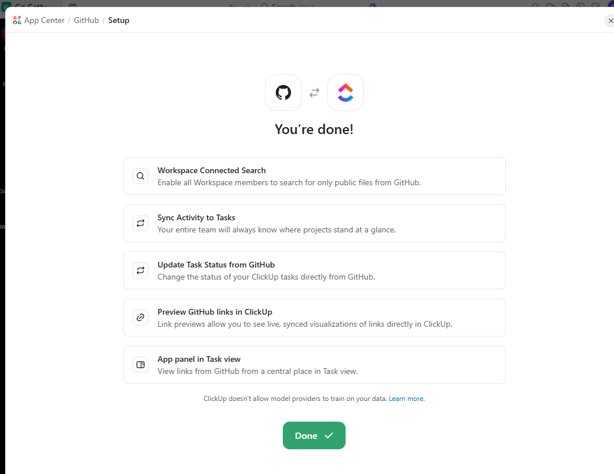
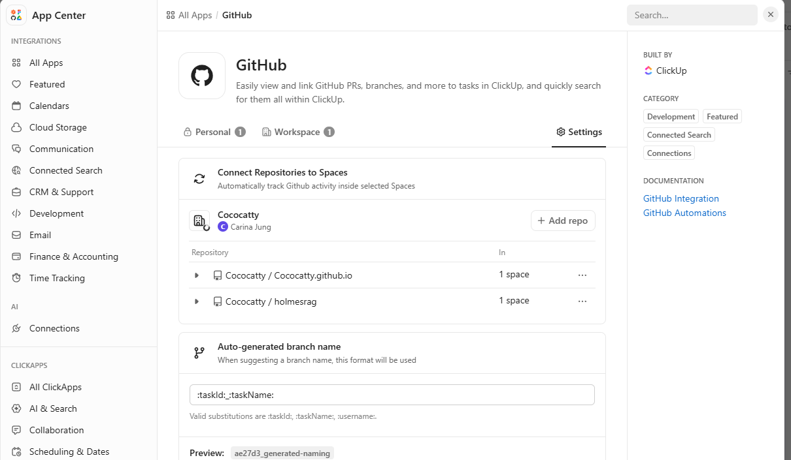
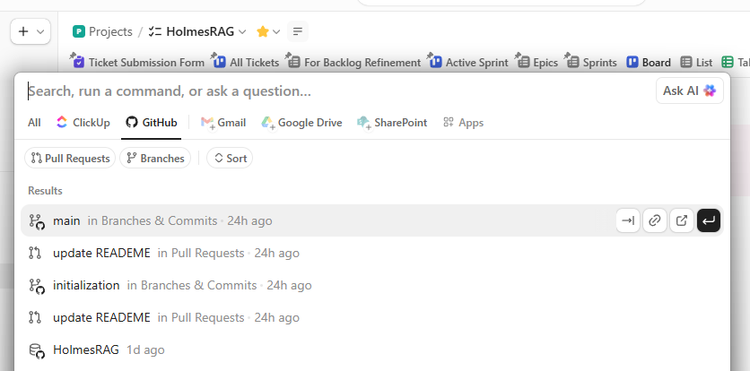

# Needs Definition and Tools Comparisons
Below are the must-have features when I was comparing various project management tools such as [ClickUp](https://clickup.com/), [Teamswork](https://teamswork.ai/).


- Good to be used for project development with AGILE;
- Easily track time and tasks duration calculation; 
- Ideally, it'd be integrable with GitHub Project so that tasks can link to the corresponding development items without heavy efforts;
- Ideally, it'd be integrable to GitHub, or development time tracking inforamtion are exportable to GitHub in Markdown format.
- If possible, allows me to manage personal tasks using the same app

Comparisons in summary:

| Feature                    | Winner      |
| -------------------------- | ----------- |
| Agile / Scrum workflows    | 🟢 ClickUp  |
| Time tracking depth        | 🔵 Teamwork |
| Personal / household tasks | 🟢 ClickUp  |
| GitHub integration         | 🟢 ClickUp  |
| Markdown / dev workflow    | 🟢 ClickUp  |


Therefore, ClickUp is selected for this project due to its ease of use..

## Templates Selection
### Must Have:

- Sprints view (Kanban)
- EPIC view
- Import function: allows me to import setup template or tasks details, which to be drafted by ChatGPT later

### Good to Have:
- Project Schedule in Gantt Chart;
- Document page

At the end, SCRUM Sprint Planning template is chosen.



# Using ChatGPT to Reduce Project Planning Effort

One of the key factors to a successful project is great project planning and definement. Important definements are:
- Development timeframes -- otherwise, the project can go until year 3000
- MVP's EPICs, Features, Stories/Tasks -- otherwise, it's very easy to get lost in the tech-wonderland.

In this project, I'm using ChatGPT to help me refine and fulfilled most of the key details instead of me drafting every little details. The prompt I used was:

```
MVP of this project is building a working chatbot with reasonable latency, regardless of accuracy. Help me to answer: 
- project start date is 3rd May 2026, with working 2-3 hours per day, define corresponding fortnightly sprints, include the details such as expected durations; 
- define the relevant EPIC, Features, include the details; 

Prepare your final result in csv format, importable to ClickUp
```

As a result, 3 EPICs and 3 Sprints, along with relevant high-level tasks are created to meet the MVP puropse.


# Set up the Project

To speed up the process, I used the "Import template" feature in ClickUp, which allows me to download the pre-set articles into a ClickUp project:




As a result, project basic setup is completed along with ChatGPT-generated articles, with further refinement to complete:



# GitHub Project Board

Next step is enabling GitHub integration in ClickUp:




# Usage Note

## Use commit/PR auto-linking

In GitHub commits or PRs, include: ClickUp task ID (e.g. CU-123)

ClickUp will automatically attach:

- commits
- PRs
- branches

In the meanwhile, GitHub Projects is used for dev workflow, with the customized statuses columns.

👉 Note, to keep it simple, GH Projct statues are NOT synced to ClickUp statuses.

# What this Setup Gives
✅ 
The current project management setup is:

- ClickUp = EPICs, Features, Sprints (planning layer) --> remains clean for Agile planning;
- GitHub = Issues + Projects board (execution layer) --> fast for dev work.

# Viola-la-la!




